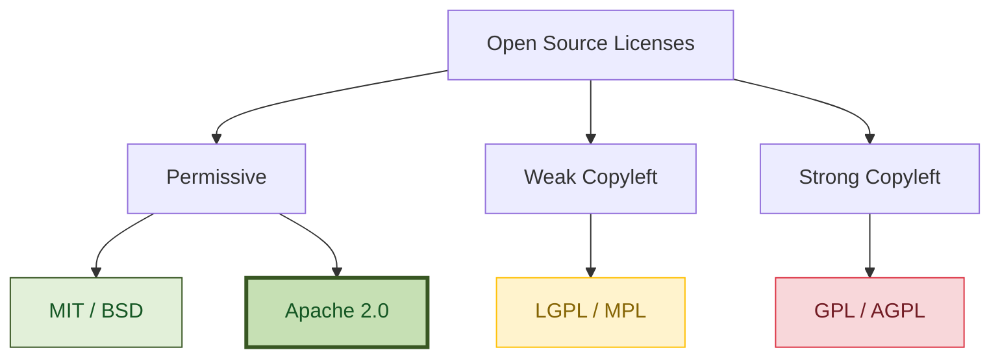

| **Explicit Patent Protection** | ❌ No | ✅ **Yes (Patent Grant)** | ❌ No | 🟡 Partial |
# Open-Source Licensing in the Enterprise: Why Apache 2.0 Makes Dext Production-Ready for Large Businesses

When software architects and CTOs at enterprise-scale corporations (such as multinational financial institutions, large ERP providers, or major global players) select a technology stack, the evaluation criteria extend far beyond compiler speed and ergonomic DSLs. 

A silent but critical gatekeeper in every modern large enterprise is **Legal Compliance and IP (Intellectual Property) Protection**. 

In high-throughput environments, a single copyleft or legally blind open-source dependency can trigger mandatory legal audits, block production deployments, or even force proprietary systems to open-source their core IP.

---

## 1. The Post-Commit Pipeline Reality: A Real-World Case Study

Consider a typical scenario in a major global technology unit. The engineering team is moving fast, pushing code to repository branches multiple times a day. To enforce security and legal compliance at scale, the company utilizes automated vulnerability and license scanners like **Snyk** integrated directly into the post-commit CI/CD pipeline.

One afternoon, a senior architect is suddenly summoned to a meeting with the corporate legal and compliance team. 

```
[Developer Push] ──> [CI/CD Pipeline] ──> [Snyk Scan] ──> ❌ BUILD FAILED!
                                                              │
                                            [Legal Compliance Vetoes Deployment]
                                                              │
                                            [Architect Summoned to Remediation]
```

### The Friction
What triggered the alarm? A developer, looking to solve a small utility issue quickly, imported a lightweight open-source helper library. The library seemed perfect, functional, and was labeled "open-source." However, it carried a copyleft license (such as GPL) or was a permissive library built on a copyleft foundation (like a minimal web package relying on an LGPL-3.0 socket transport).

The consequences of this single commit are severe:
* **Blocked Pipeline**: The Snyk scan automatically broke the build, blocking the entire release pipeline.
* **IP Risk Audit**: The legal team must audit whether any proprietary intellectual property has been "contaminated" or statically linked to the copyleft code.
* **Wasted Engineering Hours**: The architectural team is forced to halt development, explain the mistake to non-technical legal officers, and spend days stripping out the library and rewriting the functionality from scratch.

This reality highlights a fundamental truth: **Developer convenience must never compromise legal safety.**

---

## 2. The Open-Source License Spectrum

Open-source licenses generally fall into three categories. Their differences determine whether your business can legally bundle a library into closed-source proprietary software.



### 1.1. Permissive Licenses (MIT, BSD, Apache 2.0)
These licenses allow anyone to use, modify, distribute, sublicense, and sell the software in proprietary, closed-source commercial applications. They offer maximum freedom with minimal restrictions.

### 1.2. Copyleft/ShareAlike Licenses (GPL)
Often referred to as "viral" licenses. If you modify or link a GPL library into your application and distribute it, **you are legally forced to open-source your entire proprietary codebase under the same GPL license**. For commercial software companies, this is an immediate **red flag** and a deal-breaker.

### 1.3. Weak Copyleft Licenses (LGPL, MPL)
These allow linking (dynamic or static) without forcing your proprietary code to become open-source, *as long as you do not modify the library itself*. However, their compliance rules are notoriously complex and highly scrutinized by corporate legal departments.

---

## 2. The Silent Trap: Permissive but "Patent-Blind" (MIT vs. Apache 2.0)

A common misconception among developers is that the **MIT License** is the perfect corporate license because of its simplicity. While popular for small utilities, MIT has a massive, critical loophole for large enterprise software: **the lack of explicit patent grants**.

### The MIT Patent Loophole
The MIT license grants copyright permissions but is completely silent regarding patents. This creates two catastrophic risks for a business:

1. **Submarine Patents**: A contributor might submit code to an MIT-licensed project that is covered by one of their active patents. If your company uses this project in a high-revenue commercial system, that contributor (or their parent company) can legally sue you for patent infringement, demanding massive royalties. The MIT copyright grant does not shield you from patent litigation.
2. **Patent Trolling**: Competitors can weaponize patents against your system because the open-source library you built on did not require contributors to sign away patent litigation rights.

### The Apache 2.0 Shield: Complete Patent Peace
The **Apache 2.0 License** was engineered specifically to solve the patent loophole, making it the preferred license for robust enterprise software (chosen by Google for Kubernetes/Android, the Apache Foundation, and Microsoft for .NET core libraries).

Apache 2.0 implements two vital protections:

* **Explicit Patent Grant**: Every contributor to an Apache 2.0 project automatically grants users a worldwide, royalty-free, perpetual, and irrevocable patent license to use their contributions.
* **Patent Retaliation Clause**: If a user initiates patent litigation against *any* entity claiming that the Apache 2.0 software infringes their patents, **their license to the software is terminated immediately**. This acts as an intellectual property peace treaty, preventing patent lawsuits entirely.

---

## 3. Brand Protection: Trademarks

For a framework like Dext, building an ecosystem of high quality, stability, and trust is paramount. 
* Under **MIT**, anyone can fork your code, keep your name, repackage it with buggy modifications, and distribute it, potentially damaging the brand reputation of the original framework.
* **Apache 2.0 explicitly excludes trademark rights**. It states that users cannot use the trade names, trademarks, service marks, or product names of the licensor without express permission. This ensures that the name **Dext** remains synonymous with professional-grade, high-performance software, protecting both the framework and the companies that build on it.

---

## 4. Comparing Licenses for Corporate Compliance

Below is a direct comparison of the key licenses that corporate legal teams evaluate during software audits:

| Legal / Compliance Metric | MIT | Apache 2.0 | LGPL | GPL / AGPL |
|:---|:---:|:---:|:---:|:---:|
| **Commercial Use in Closed Source** | ✅ Yes | ✅ Yes | 🟡 Conditional | ❌ **Strictly Prohibited** |
| **Patent Litigation Retaliation** | ❌ No | ✅ **Yes (Legal Shield)** | ❌ No | ❌ No |
| **Trademark Protection** | ❌ No | ✅ **Yes** | ❌ No | ❌ No |
| **IP Exposure Risk for Core App** | 🟢 None | 🟢 None | 🟡 Medium (Static Link Risk) | 🔴 **High (Systemic)** |
| **Compliance Complexity / Audits** | 🟢 Extremely Low | 🟢 Low | 🔴 High | 🔴 Critical |

---

## 5. Why Dext is Enterprise-Grade from Day One

By releasing the Dext Framework under the **Apache 2.0 License**, the creators of Dext made a highly conscious, strategic architectural decision to provide corporate clients with absolute legal security.

1. **Production-Ready Compliance**: Dext easily clears automated dependency scans (Black Duck, Snyk, WhiteSource) used by corporate compliance teams at major global enterprises.
2. **Safe from Patent Litigation**: Companies can build high-revenue proprietary applications on top of the Dext ORM and Web Server with the absolute certainty that they are protected by an irrevocable patent license grant from all contributors.
3. **No Viral Contamination**: Dext is completely free of GPL/AGPL dependencies. Unlike minimal frameworks that rely on LGPL-3.0 libraries (such as `Delphi-Cross-Socket` for WebSocket handling), Dext enforces strict separation of concerns, ensuring that your commercial ERP or fiscal system remains 100% proprietary and closed-source.
4. **Brand Integrity**: The Apache 2.0 trademark clause ensures that your technology choice is backed by a secure brand name, protecting your business from copycat projects and untrusted forks.

## Conclusion

Performance metrics, change tracking, and memory efficiency are vital, but **legal compliance is the ultimate gatekeeper of enterprise deployment**. 

Dext's Apache 2.0 license is not just a detail; it is a **business-critical feature** that enables CTOs and Architects to confidently propose Dext as the modern, high-performance, and legally secure foundation for the next decade of enterprise Delphi systems.
