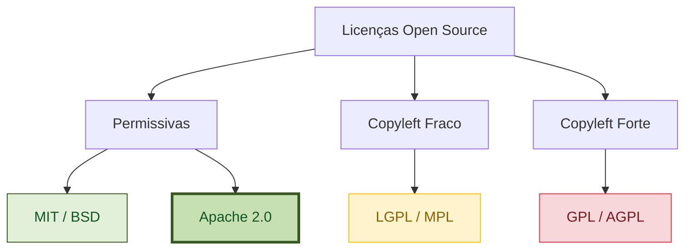

# Licenciamento Open-Source no Ambiente Corporativo: Por que a Licença Apache 2.0 Torna o Dext Pronto para Produção em Grandes Empresas

Quando arquitetos de software e CTOs de empresas de escala corporativa (como instituições financeiras multinacionais, grandes provedores de ERP ou players globais de tecnologia) selecionam uma stack tecnológica, os critérios de avaliação vão muito além da velocidade do compilador e de DSLs ergonômicas. 

Um guardião silencioso, mas crítico, em toda grande empresa moderna é a **Conformidade Legal e a Proteção de PI (Propriedade Intelectual)**. 

Em ambientes corporativos de alta criticidade, uma única dependência open-source sob licença copyleft ou juridicamente obscura pode desencadear auditorias legais obrigatórias, bloquear deploys em produção ou até mesmo forçar a empresa a abrir o código-fonte proprietário de seus sistemas core.

---

## 1. A Realidade do Pipeline de Commit: Um Estudo de Caso Real

Considere um cenário típico em uma unidade de tecnologia global. A equipe de engenharia está trabalhando em ritmo acelerado, realizando commits e pushes de código várias vezes ao dia. Para garantir a segurança e a conformidade jurídica em escala, a empresa utiliza ferramentas automatizadas de análise de vulnerabilidade e licenciamento, como o **Snyk**, integradas diretamente ao pipeline de CI/CD pós-commit.

Em uma tarde comum, um arquiteto sênior é repentinamente convocado para uma reunião de emergência com a equipe de compliance e o departamento jurídico corporativo.

```
[Push do Desenvolvedor] ──> [Pipeline de CI/CD] ──> [Snyk Scan] ──> ❌ BUILD FALHOU!
                                                                      │
                                                [Compliance Vetou a Publicação]
                                                                      │
                                                [Arquiteto Convocado para Ajuste]
```

### O Atrito
O que disparou o alarme? Um desenvolvedor, buscando resolver um pequeno problema de utilidade de forma rápida, importou uma biblioteca auxiliar open-source leve. A biblioteca parecia perfeita, funcional e estava rotulada como "open-source". No entanto, ela carregava uma licença copyleft (como a GPL) ou era uma biblioteca permissiva construída sobre uma base copyleft (como um pacote web minimalista que dependia de um transporte de socket sob LGPL-3.0).

As consequências desse único commit são graves:
* **Pipeline Bloqueado**: A verificação do Snyk quebrou automaticamente o build, paralisando todo o pipeline de release.
* **Auditoria de Risco de PI**: A equipe jurídica precisa auditar se alguma propriedade intelectual proprietária foi "contaminada" ou vinculada estaticamente ao código copyleft.
* **Horas de Engenharia Desperdiçadas**: A equipe de arquitetura é forçada a interromper o desenvolvimento, explicar o erro a assessores jurídicos não técnicos e passar dias removendo a biblioteca e reescrevendo a funcionalidade do zero.

Essa realidade destaca uma verdade fundamental: **A conveniência do desenvolvedor nunca deve comprometer a segurança jurídica corporativa.**

---

## 2. O Espectro das Licenças Open-Source

As licenças open-source geralmente se enquadram em três categorias principais. Suas diferenças determinam se sua empresa pode legalmente empacotar e distribuir uma biblioteca dentro de um software proprietário de código fechado.



### 1.1. Licenças Permissivas (MIT, BSD, Apache 2.0)
Essas licenças permitem que qualquer pessoa use, modifique, distribua, sublicencie e venda o software em aplicações comerciais proprietárias de código fechado. Oferecem liberdade máxima com restrições mínimas.

### 1.2. Licenças Copyleft/Compartilhamento pela Mesma Licença (GPL)
Frequentemente chamadas de licenças "virais". Se você modificar ou vincular uma biblioteca GPL em sua aplicação e distribuí-la, **você será legalmente obrigado a abrir todo o código-fonte proprietário do seu sistema sob a mesma licença GPL**. Para empresas de software comercial, isso é um **sinal vermelho** imediato e impeditivo.

### 1.3. Licenças Copyleft Fraco (LGPL, MPL)
Permitem o vínculo (dinâmico ou estático) sem forçar o seu código proprietário a se tornar open-source, *desde que você não modifique a própria biblioteca*. No entanto, suas regras de conformidade são complexas e altamente escrutinadas pelos departamentos jurídicos corporativos.

---

## 3. A Armadilha Silenciosa: Permissiva, mas "Cega para Patentes" (MIT vs. Apache 2.0)

Um equívoco comum entre os desenvolvedores é pensar que a **Licença MIT** é a licença corporativa ideal devido à sua extrema simplicidade. Embora excelente para pequenos utilitários, a MIT possui uma lacuna massiva e crítica para softwares corporativos de grande porte: **a ausência de concessões explícitas de patentes**.

### A Brecha de Patentes da MIT
A licença MIT concede permissões de direitos autorais (copyright), mas é completamente omissa em relação a patentes. Isso cria dois riscos catastróficos para um negócio:

1. **Patentes Submarinas (Submarine Patents)**: Um colaborador pode enviar código para um projeto licenciado sob MIT que esteja coberto por uma de suas patentes ativas. Se sua empresa utilizar esse projeto em um sistema comercial de alta receita, esse colaborador (ou sua empresa-mãe) poderá processá-lo legalmente por violação de patente, exigindo royalties massivos. A concessão de direitos autorais da MIT não protege sua empresa contra litígios de patentes.
2. **Ataques de Patentes (Patent Trolling)**: Concorrentes podem usar patentes como armas contra seu sistema porque a biblioteca open-source na qual você se baseou não exigia que os colaboradores abrissem mão de direitos de litígio de patentes.

### O Escudo Apache 2.0: Paz Completa de Patentes
A **Licença Apache 2.0** foi projetada especificamente para resolver essa lacuna de patentes, tornando-se a licença preferida para softwares corporativos robustos (escolhida pelo Google para o Kubernetes/Android, pela Apache Foundation e pela Microsoft para as bibliotecas core do .NET).

A Apache 2.0 implementa duas proteções fundamentais:

* **Concessão Explícita de Patentes**: Cada colaborador de um projeto Apache 2.0 concede automaticamente aos usuários uma licença de patente mundial, livre de royalties, perpétua e irrevogável para utilizar suas contribuições.
* **Cláusula de Retaliação de Patentes**: Se um usuário iniciar um litígio de patentes contra *qualquer* entidade alegando que o software sob Apache 2.0 viola suas patentes, **sua licença para o software será rescindida imediatamente**. Isso funciona como um tratado de paz de propriedade intelectual, prevenindo processos de patentes.

---

## 4. Proteção de Marca: Marcas Registradas (Trademarks)

Para um framework como o Dext, construir um ecossistema de alta qualidade, estabilidade e confiança é primordial.
* Sob a licença **MIT**, qualquer pessoa pode criar um fork do seu código, manter o seu nome, empacotá-lo com modificações instáveis ou de baixa qualidade e distribuí-lo, potencialmente prejudicando a reputação da marca do framework original.
* **A Apache 2.0 exclui explicitamente direitos de marca registrada**. Ela estabelece que os usuários não podem usar os nomes comerciais, marcas registradas, marcas de serviço ou nomes de produtos do licenciador sem permissão expressa. Isso garante que o nome **Dext** permaneça sinônimo de software de nível profissional e alto desempenho, protegendo tanto o framework quanto as empresas que o adotam.

---

## 5. Comparação de Licenças para Conformidade Corporativa

Abaixo está uma comparação direta das principais licenças que os departamentos jurídicos corporativos avaliam durante as auditorias de software:

| Métrica Legal / Compliance | MIT | Apache 2.0 | LGPL | GPL / AGPL |
|:---|:---:|:---:|:---:|:---:|
| **Uso Comercial em Código Fechado** | ✅ Sim | ✅ Sim | 🟡 Condicional | ❌ **Estritamente Proibido** |
| **Proteção contra Litígio de Patentes** | ❌ Não | ✅ **Sim (Escudo Legal)** | ❌ Não | ❌ Não |
| **Proteção de Marca Registrada** | ❌ Não | ✅ **Sim** | ❌ Não | ❌ Não |
| **Risco de Exposição de PI para o App Core** | 🟢 Nenhum | 🟢 Nenhum | 🟡 Médio (Risco de Link Estático) | 🔴 **Alto (Sistêmico)** |
| **Complexidade de Conformidade / Auditorias** | 🟢 Extremamente Baixa | 🟢 Baixa | 🔴 Alta | 🔴 Crítica |

---

## 6. Por que o Dext é Pronto para Empresas desde o Primeiro Dia

Ao disponibilizar o Dext Framework sob a **Licença Apache 2.0**, os criadores do Dext tomaram uma decisão arquitetônica estratégica e consciente para fornecer aos clientes corporativos segurança jurídica absoluta.

1. **Conformidade Pronta para Produção**: O Dext passa facilmente por varreduras automatizadas de dependências (como Black Duck, Snyk, WhiteSource) usadas por equipes de compliance em grandes corporações globais.
2. **Seguro contra Litígios de Patentes**: As empresas podem criar aplicações proprietárias de alta receita sobre o Dext ORM e o Web Server com a certeza absoluta de que estão protegidas por uma concessão irrevogável de licença de patente de todos os colaboradores.
3. **Livre de Contaminação Viral**: O Dext é totalmente isento de dependências GPL/AGPL. Diferente de frameworks minimalistas que dependem de bibliotecas LGPL-3.0 (como o `Delphi-Cross-Socket` para manipulação de WebSockets), o Dext reforça uma separação estrita de conceitos, garantindo que o seu ERP comercial ou sistema fiscal permaneça 100% proprietário e de código fechado.
4. **Integridade da Marca**: A cláusula de marca registrada da Apache 2.0 garante que sua escolha tecnológica seja respaldada por um nome de marca seguro, protegendo seu negócio contra projetos imitadores e forks não confiáveis.

## Conclusão

Métricas de desempenho, rastreamento de mudanças e eficiência de memória são vitais, mas **a conformidade legal é o portão final para a implantação corporativa**.

A licença Apache 2.0 do Dext não é apenas um detalhe burocrático; é um **recurso de missão crítica** que permite a CTOs e Arquitetos proporem o Dext com total confiança como a base moderna, de alto desempenho e juridicamente segura para a próxima década de sistemas empresariais em Delphi.
