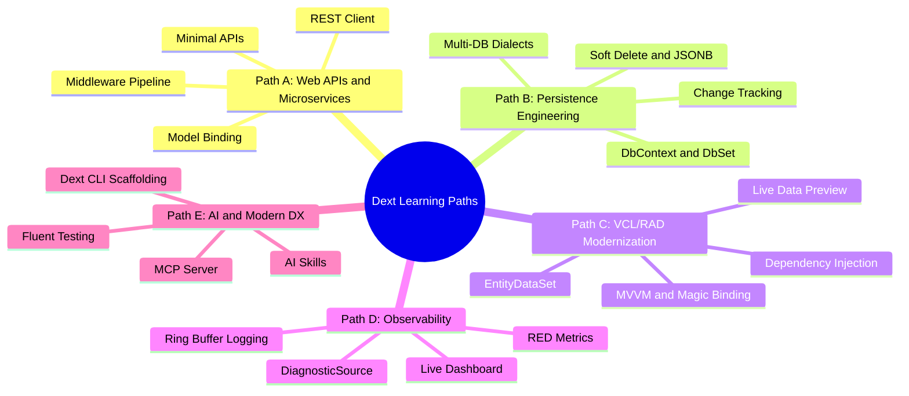

# Feature Curation & Learning Paths

This document outlines the technical maturity analysis of the features in the **Dext Framework** along with structured learning paths designed for progressive adoption without cognitive overload.

---

## Component Maturity Table

To ensure transparency, predictability, and enterprise confidence, Dext's components are categorized into three technical maturity levels:

| Component / Feature | Maturity Level | Primary Scope / Units | Status & Contribution |
| :--- | :---: | :--- | :--- |
| **Dext Core Foundation** | 🟢 **Stable** | `Dext.Core.Reflection`, `Dext.DI.*`, `Dext.Core.Activator`, `Dext.Json` (DataObjects), `Dext.Configuration.Core`, `Dext.Types.*` (TUUID, Nullable, Lazy), `Dext.Core.ValueConverters`, `Dext.Core.Memory`, `Dext.Core.Writers` | Ready for large-scale commercial production. Fully consolidated APIs. |
| **Collections & Concurrency** | 🟢 **Stable** | `Dext.Collections` (TRawList, TRawDictionary), `Dext.Collections.Extensions` (LINQ), `Dext.Collections.Concurrent`, `Dext.Collections.Frozen`, `Dext.Collections.Simd` | High performance with SIMD and lock-free reads ready for concurrent loads. |
| **Dext ORM (Core)** | 🟢 **Stable** | `TDbContext`, `DbSet<T>`, Change Tracking, Identity Map, Dialect Support, Soft Delete | Proven in high-load production (~800k req/day). Extremely robust transactions. |
| **REST Client** | 🟢 **Stable** | `Dext.Net.RestClient`, connection pooling, auto-serialization, OAuth 2.0 cache | High-performance network connector with smart TCP/SSL connection reuse. |
| **Dext Web Framework** | 🟢 **Stable** | `TWebApplication` bootstrapping, Minimal APIs, routing engine, model binding | Clean modular design. High-performance direct competitor to Horse. |
| **Database as API** | 🟢 **Stable** | `Dext.Web.DataApi` (auto CRUD, specification filters, query parser) | Dynamic CRUD route generation via RTTI in runtime with advanced QueryString filtering. |
| **EntityDataSet (VCL Bridge)** | 🟢 **Stable** | `Dext.Data.EntityDataSet`, AST parsing, Live Data Preview, Design-Time experts | Allows clean decoupled architecture (MVVM/Clean Arch) with classic Delphi grids and reports. |
| **Dext Testing & Test Explorer** | 🟢 **Stable** | `Dext.Testing`, `Dext.Mocks`, `Dext.Testing.Runner`, RAD Studio Test Explorer Expert | Complete testing suite with Fluent Assertions, Class/Interface Mocking, AutoMocker, Snapshots, Code Coverage (CLI/IDE), and native IDE integration. |
| **Observability & Telemetry** | 🟡 **Evolving** | `TDiagnosticSource`, Async Ring Buffer logs, RED metrics, database profiling | Highly functional APM engine. Additional exporter integrations in progress. |
| **Code-First Migrations** | 🟡 **Evolving** | Automated schema snapshots and chronological model-based evolution | Active testing phase. Functional and safe schema evolution under final validation with the community. |
| **Desktop UI & MVVM** | 🟡 **Evolving** | `ISimpleNavigator` (Flutter-style), Magic Binding, MVVM desktop controllers | Functional and stable for ERP modernization. Ongoing ergonomics refinements. |
| **Dext CLI & Tools** | 🟡 **Evolving** | `dext.exe` CLI, code generators (`dext new`, `dext add`) | Fully functional. Continuous template additions and setup polishing. |
| **Model Context Protocol (MCP)** | 🔵 **Experimental** | Native MCP Server, Stdio/HTTP/SSE transports, `[MCPTool]` attributes | Under active development for seamless integration with AI agents (Cursor/Claude Code). |
| **Real-time & Redis** | 🔵 **Experimental** | Native Redis Client (~80%), SSE SignalR-like, caching, advanced health checks | APIs under validation. Contributions to the Redis caching engine are welcome. |

---

## Learning Paths

Dext is modular by design. Thanks to the **Delphi Smart Linker**, the compiler natively strips any unused units from the final compiled binary. This means Dext can be adopted as an ultra-lightweight micro-framework (focused solely on Minimal APIs) or as a comprehensive enterprise suite, without any bloat overhead!

To simplify the learning curve and prevent cognitive overload, we have divided the framework into **5 focused Learning Paths**:

### Detailed Learning Path Mapping

#### 🚀 Path A — Web APIs & Microservices (Micro-Framework Focus)
*   **Target:** Developers who need to build lightweight, fast, and scalable REST APIs, or replace tools like Horse with superior structural robustness and native DI.
*   **What to learn:**
    1.  **Bootstrapping & Minimal API** — Spin up the server fluently and map routes directly.
    2.  **Middleware Pipeline** — Adding security, CORS, custom exception handling, and compression.
    3.  **JSON Engine** — Mastering ultra-fast record/class serialization (DOM and UTF-8 low-level).
    4.  **REST Client** — Consuming external APIs with high-performance TCP connection pooling.

#### 💾 Path B — Persistence Engineering (ORM & Enterprise Focus)
*   **Target:** Software engineers managing high-concurrency databases who want to eliminate manual SQL strings by using strongly-typed LINQ and bulletproof Change Tracking.
*   **What to learn:**
    1.  **Core Persistence** — Understanding the lifecycle of `TDbContext`, `DbSet<T>`, and the Identity Map.
    2.  **Smart Types & Expression Trees** — Composing complex queries using smart properties.
    3.  **Soft Delete and JSON Columns** — Automating logical deletes and interacting natively with JSONB columns.
    4.  **Bulk Operations & Multi-Tenancy** — High-performance mass persistence and tenant isolation (Shared DB or DB-per-tenant).

#### 🏢 Path C — Legacy ERP Modernization (RAD & Clean Architecture Focus)
*   **Target:** Development teams managing legacy VCL/FMX systems with millions of lines of code who want clean, testable, UI-decoupled architectures (MVVM) without losing Delphi IDE's design-time drag-and-drop speed.
*   **What to learn:**
    1.  **Dependency Injection** — Configuring the global IoC container, managing lifecycles (Singleton, Scoped, Transient), and scope isolation.
    2.  **EntityDataSet** — Linking in-memory POCO collections to Delphi visual components in design-time (with Sync Fields and Live Data Preview).
    3.  **Magic Binding & MVVM** — Sincronizing View and ViewModel data automatically without view code-behind.

#### 📊 Path D — Observability & Telemetry (APM & Diagnostics Focus)
*   **Target:** Tech Leads and DevOps engineers who need to monitor Delphi microservices in production, detect slow database queries, and profile external network calls.
*   **What to learn:**
    1.  **Tracing & Ring Buffer** — Collecting and rendering hierarchical Gantt execution spans and asynchronous logs.
    2.  **RED Metrics** — Monitoring throughput (RPS, QPS) and CPU/Memory resource consumption.
    3.  **DB & Outbound Profiler** — Intercepting and profiling slow FireDAC SQL commands and external network request latency.

#### 🤖 Path E — AI, DX & Automation (AI & Modern Developer Experience Focus)
*   **Target:** Forward-thinking developers who want to accelerate their daily coding using artificial intelligence or build cutting-edge systems connected to autonomous AI agents.
*   **What to learn:**
    1.  **MCP Server (Model Context Protocol)** — Securely exposing tools and data from your Delphi app directly to LLMs (like Claude and GPT).
    2.  **AI Skills** — Configuring Cursor/Antigravity to generate flawless, highly idiomatic Dext code.
    3.  **Testing Framework** — Writing robust RTTI-based test suites using Fluent Assertions, Mocks, and Snapshot Testing.
    4.  **Dext CLI** — Using the terminal to speed up project creation and code units scaffolding.
