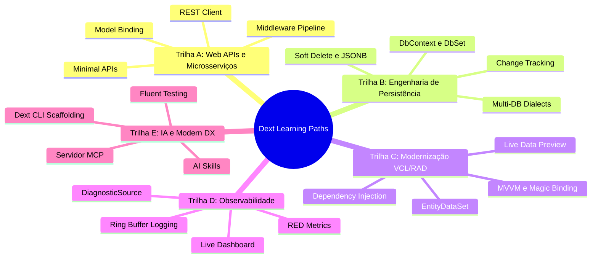

# Curadoria de Features e Caminhos de Aprendizado (Learning Paths)

Este documento apresenta a análise de maturidade técnica das features do **Dext Framework** e os caminhos estruturados de aprendizado desenhados para facilitar a adoção progressiva e sem sobrecarga cognitiva.

---

## Tabela de Maturidade de Componentes

Para garantir transparência, previsibilidade e confiança corporativa, os componentes do Dext são categorizados em três níveis de maturidade técnica:

| Componente / Feature | Nível de Maturidade | Escopo Principal / Units | Status & Contribuição |
| :--- | :---: | :--- | :--- |
| **Dext Core Foundation** | 🟢 **Estável** | `Dext.Core.Reflection`, `Dext.DI.*`, `Dext.Core.Activator`, `Dext.Json` (DataObjects), `Dext.Configuration.Core`, `Dext.Types.*` (TUUID, Nullable, Lazy), `Dext.Core.ValueConverters`, `Dext.Core.Memory`, `Dext.Core.Writers` | Pronto para produção comercial de alta escala. APIs consolidadas. |
| **Collections & Concurrency** | 🟢 **Estável** | `Dext.Collections` (TRawList, TRawDictionary), `Dext.Collections.Extensions` (LINQ), `Dext.Collections.Concurrent`, `Dext.Collections.Frozen`, `Dext.Collections.Simd` | Máxima performance com SIMD e lock-free reads prontas para uso concorrente. |
| **Dext ORM (Core)** | 🟢 **Estável** | `TDbContext`, `DbSet<T>`, Change Tracking, Identity Map, Dialect Support, Soft Delete | Provado em produção real (picos de ~800k req/dia). Transações altamente robustas. |
| **REST Client** | 🟢 **Estável** | `Dext.Net.RestClient`, connection pooling, auto-serialization, OAuth 2.0 cache | Conector de rede robusto com reuso inteligente de conexões TCP/SSL. |
| **Dext Web Framework** | 🟢 **Estável** | `TWebApplication` bootstrapping, Minimal APIs, routing engine, model binding | Estrutura modular limpa. Concorrente de alto nível ao Horse. |
| **Database as API** | 🟢 **Estável** | `Dext.Web.DataApi` (CRUD automático, specification filters, query parser) | Geração dinâmica de rotas REST CRUD via RTTI em runtime com filtros via QueryString. |
| **EntityDataSet (VCL Bridge)** | 🟢 **Estável** | `Dext.Data.EntityDataSet`, AST parsing, Live Data Preview, Design-Time experts | Permite usar arquitetura desacoplada (MVVM/Clean Arch) com grids e relatórios Delphi. |
| **Observabilidade & Telemetria** | 🟡 **Em Evolução** | `TDiagnosticSource`, Async Ring Buffer logs, RED metrics, database profiling | Estrutura APM altamente funcional. Novas integrações de exportadores em progresso. |
| **Code-First Migrations** | 🟡 **Em Evolução** | Snapshots automatizados de schemas e evolução cronológica baseada em modelos | Sistema funcional e seguro em validação final com a comunidade. |
| **Desktop UI & MVVM** | 🟡 **Em Evolução** | `ISimpleNavigator` (Flutter-style), Magic Binding, MVVM desktop controllers | Funcional e estável para modernização de ERPs. Melhorias contínuas de ergonomia visual. |
| **Dext CLI & Tools** | 🟡 **Em Evolução** | `dext.exe` CLI, code generators (`dext new`, `dext add`) | Totalmente funcional. Novos templates e polimentos de setup contínuos. |
| **Model Context Protocol (MCP)** | 🔵 **Experimental** | Servidor MCP nativo, Stdio/HTTP/SSE transports, `[MCPTool]` attributes | Em desenvolvimento ativo para integração com agentes de IA (Cursor/Claude Code). |
| **Real-time & Redis** | 🔵 **Experimental** | Client Redis nativo (~80%), SSE SignalR-like, caching, health checks avançados | APIs sob validação técnica. Contribuições na engine de cache Redis são bem-vindas. |

---

## Caminhos de Conhecimento (Learning Paths)

O Dext é um ecossistema modular por design. Graças ao **Delphi Smart Linker**, o compilador remove nativamente qualquer unidade não utilizada no binário final. Isso significa que o Dext pode ser adotado como um micro-framework ultraleve (focado apenas em Minimal APIs) ou como uma suíte corporativa completa, sem overhead de peso ou CPU!

Para guiar os desenvolvedores de forma progressiva, organizamos o ecossistema em **5 Trilhas Temáticas**:

### Mapeamento Detalhado das Trilhas

#### 🚀 Trilha A — Web APIs & Microsserviços (Foco Micro-Framework)
*   **Para quem:** Desenvolvedores que precisam construir APIs REST leves, rápidas e escaláveis, ou substituir soluções como Horse com mais robustez estrutural e DI nativa.
*   **O que aprender:**
    1.  **Bootstrapping & Minimal API** — Subir o servidor de forma fluente e mapear rotas diretas.
    2.  **Middleware Pipeline** — Adicionar segurança, tratamento de exceções, CORS e compressão.
    3.  **JSON Engine** — Dominar a serialização ultrarrápida de records e classes (DataObjects e UTF-8 low-level).
    4.  **REST Client** — Consumir APIs externas com alta performance e pooling de conexões TCP.

#### 💾 Trilha B — Persistência Avançada (Foco ORM & Enterprise)
*   **Para quem:** Engenheiros de software que gerenciam bancos de dados de alta concorrência e querem eliminar SQL strings manuais usando LINQ fortemente tipado e Change Tracking confiável.
*   **O que aprender:**
    1.  **Core Persistence** — Compreender o ciclo de vida do `TDbContext`, `DbSet<T>` e o Identity Map.
    2.  **Smart Types & Expression Trees** — Criar queries complexas usando operadores e propriedades inteligentes.
    3.  **Soft Delete e JSON Columns** — Mapear exclusões lógicas automáticas e interagir nativamente com colunas JSONB.
    4.  **Bulk Operations & Multi-Tenancy** — Persistência em massa de alta performance e isolamento de tenants (Shared DB ou DB por tenant).

#### 🏢 Trilha C — Modernização de ERPs Legados (Foco RAD & Clean Architecture)
*   **Para quem:** Equipes com sistemas legados VCL/FMX gigantescos que querem adotar arquitetura limpa, desacoplada e testável (MVVM) sem perder o poder visual da IDE Delphi.
*   **O que aprender:**
    1.  **Dependency Injection** — Configurar o container IoC global, gerenciar ciclos de vida (Singleton, Scoped, Transient) e isolamento de escopo.
    2.  **EntityDataSet** — Mapear coleções de objetos POCO de memória para componentes visuais Delphi em tempo de design (Sync Fields e Live Data Preview).
    3.  **Magic Binding & MVVM** — Sincronizar dados entre View e ViewModel sem código acoplado atrás do formulário.

#### 📊 Trilha D — Observabilidade & Telemetria (Foco APM & Diagnósticos)
*   **Para quem:** Tech Leads e DevOps que precisam monitorar a saúde de microsserviços Delphi em produção, identificar gargalos de queries lentas e extrair métricas do sistema.
*   **O que aprender:**
    1.  **Tracing & Ring Buffer** — Coleta e visualização Gantt hierárquica de spans de execução e logs assíncronos.
    2.  **RED Metrics** — Monitorar throughput (RPS, QPS) e status de consumo de CPU/Memória.
    3.  **DB & Outbound Profiler** — Interceptar e auditar comandos SQL FireDAC lentos e latência de requisições de rede externas.

#### 🤖 Trilha E — Inovação & Agentes Inteligentes (Foco AI, DX & Automação)
*   **Para quem:** Desenvolvedores inovadores que querem acelerar sua entrega diária usando Inteligência Artificial ou criar integrações de ponta conectadas a agentes autônomos.
*   **O que aprender:**
    1.  **Servidor MCP (Model Context Protocol)** — Expor com segurança as ferramentas e dados da sua app Delphi para LLMs (como Claude e GPT).
    2.  **AI Skills** — Ensinar assistentes de IA (Cursor/Antigravity) a gerar código idiomático e sem alucinações para o Dext.
    3.  **Testing Framework** — Escrever suítes de testes robustas via RTTI com Fluent Assertions, Mocks e Snapshot Testing.
    4.  **Dext CLI** — Utilizar o terminal para agilizar a criação de projetos e scaffolding de unidades de código.
