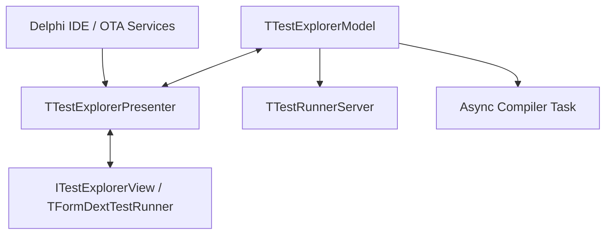

# 📑 Refactoring Proposal: Dext Test Explorer Architectural Decoupling & Stability

This document analyzes the root causes of IDE freezes/hangs during compilation and uninstallation of the Dext Test Explorer expert, and proposes a complete architectural redesign to ensure 100% stability, UI responsiveness, and framework independence.

---

## 🔍 1. Root Cause Analysis of IDE Freezes

Our technical audit identified three structural flaws in the current implementation of the IDE Expert:

### A. BPL Dependency Lock (The `Requires` Trap)
*   **The Problem:** The design-time package `Dext.Testing.Design.dpk` currently references `Dext.Testing` in its `requires` clause and imports implementation units (`Dext.Testing.Runner`, `Dext.Testing.Report`) in the implementation section of the dockable form.
*   **The Consequence:** When the IDE loads the expert, `bds.exe` locks `Dext.Testing.bpl` in memory. If the developer tries to compile or rebuild the core framework (`Dext.Testing.dpk`) within the IDE, the compiler encounters a file write lock error, freezing or crashing the compilation pipeline.
*   **The Solution:** Remove the `requires Dext.Testing` dependency. The expert must be 100% decoupled from the framework it tests. All communication is already done via TCP/JSON, so the expert only needs to parse simple JSON structures natively, requiring no runtime framework units.

### B. Infinite Socket `recv` Block During Finalization
*   **The Problem:** When the package is uninstalled or the IDE closes, `TFormDextTestRunner.Destroy` invokes `FServer.Stop`. This calls `FThread.Terminate`, closes the listening socket (`FSocket`), and calls `FThread.WaitFor` on the main thread.
*   **The Consequence:** If a client connection is currently open, the background thread is blocked inside `recv(ClientSock, ...)` (line 179 of `Dext.Testing.Design.Server.pas`). Closing the *listening* socket does not close or interrupt blocking reads on active *client* sockets. Thus, the thread remains permanently blocked inside `recv`, and the main thread hangs indefinitely on `FThread.WaitFor`, causing the IDE to freeze.
*   **The Solution:** Maintain a thread-safe registry of all active client sockets in the server thread. When `Terminate` or `Stop` is called, explicitly close both the listener socket and all active client sockets.

### C. Synchronous Compilation on Main UI Thread
*   **The Problem:** The direct compilation bypass (`CompileProjectDirect`) executes `dcc32.exe` via `ExecuteAndCapture`, which calls `WaitForSingleObject(LPi.hProcess, INFINITE)` directly on the main VCL UI thread.
*   **The Consequence:** While the compiler is running, the main thread is completely blocked. If the compiler needs to query the IDE or locks files, it deadlocks.
*   **The Solution:** Move compilation and process execution to an asynchronous background `TTask` or background thread. The UI should display a non-blocking marquee progress bar and listen for execution completion events.

---

## 🏗️ 2. Proposed Architecture: MVP (Model-View-Presenter)

To separate UI elements from business logic and ensure thread safety, we will implement the **Model-View-Presenter (MVP) with Passive View** pattern:



### Key Components

1.  **The Model (`TTestExplorerModel`)**
    *   Maintains the state of projects, test locations, and execution history.
    *   Manages the Winsock server (`TTestRunnerServer`) and receives raw JSON reports.
    *   Triggers asynchronous compilation and runner execution.
    *   Has zero knowledge of VCL forms or treeviews.

2.  **The View Interface (`ITestExplorerView`)**
    *   A pure interface declaring abstract UI commands:
        ```pascal
        type
          ITestExplorerView = interface
            ['{A8B3C4D1-E2F3-4C5E-BF6A-7B8C9D0E1F2A}']
            procedure ShowProgress(const AMsg: string; AMarquee: Boolean);
            procedure HideProgress;
            procedure ClearTestTree;
            procedure UpdateTestNode(const APath, AStatus: string; ADuration: Double; const AErrorMsg, AStackTrace: string);
            procedure AppendConsoleLine(const ALine: string);
          end;
        ```

3.  **The Presenter (`TTestExplorerPresenter`)**
    *   Binds the Model to the View.
    *   Listens to Model events (e.g., `OnTestFinished`, `OnCompileComplete`) and safely marshals them to the main thread via `TThread.Queue` to update the View.
    *   Handles UI action triggers (e.g., `RunSelectedClick`) by invoking the corresponding async methods on the Model.

---

## 📋 3. Step-by-Step Refactoring Plan

### Phase 1: Package Decoupling
1.  **Edit `Dext.Testing.Design.dpk`**: Remove `requires Dext.Testing;`.
2.  **Clean up Uses**: Remove references to `Dext.Testing.Runner` and `Dext.Testing.Report`.
3.  **Local JSON Parsers**: Implement lightweight JSON mappings in the expert for receiving test results, ensuring it doesn't need to link to framework classes.

### Phase 2: Thread-Safe Winsock Server
1.  **Track Client Sockets**: Add a thread-safe `TList<TSocket>` to `TTestRunnerServerThread` to store all active client sockets.
2.  **Safe Shutdown**: In the `Destroy` and `Stop` methods, iterate over the list of active client sockets and call `closesocket(Sock)` on each, immediately unblocking any active `recv` calls.

### Phase 3: Asynchronous Execution & Compilation
1.  **Async Build**: Move the dcc compilation block inside a `TTask.Run` or an anonymous thread.
2.  **Async Process Wait**: Keep the runner process execution asynchronous, sending non-blocking state updates to the presenter.
3.  **Cancellation Support**: Integrate `ICancellationToken` or a simple `Boolean` flag to allow aborting compilation or test execution safely at any time.

### Phase 4: Separating UI (VCL Form refactoring)
1.  **Passive Form**: Strip all compilation, registry, and socket handling from `TFormDextTestRunner`.
2.  **Interface Binding**: Implement `ITestExplorerView` in the form.
3.  **Introduce Presenter**: Create `Dext.Testing.Design.Presenter.pas` and redirect all user clicks and events through it.

---

> [!NOTE]
> This plan ensures that the IDE Expert does not block the UI, shuts down cleanly without socket deadlocks, and compiles independently of the framework packages.
