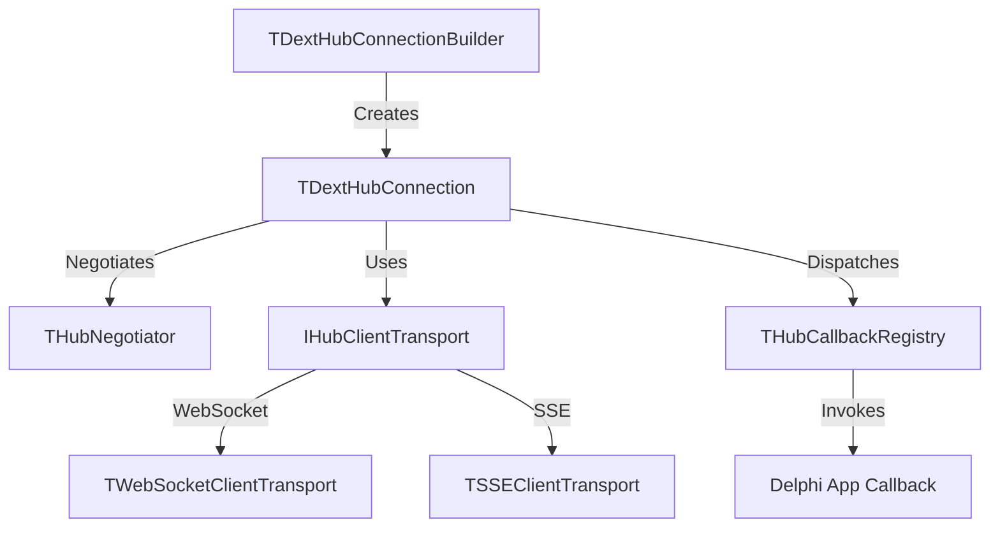

# 📑 S42: Delphi Hub Client (SignalR-compatible)

**Status:** ⏳ Proposed
**Owner:** Cesar Romero & Engineering Team
**Created:** 2026-06-18
**Dependencies:** S40 (WebSocket Transport & SignalR Hub Integration)
**Enables:** Real-time Delphi Desktop/ERP Client Integrations

---

## 1. Goal

Implement a **native Delphi Hub Client** (`Dext.Web.Hubs.Client.pas`) that allows Delphi applications (Desktop VCL/FMX, Windows Services, CLI tools, or secondary backends) to connect to `Dext.Web.Hubs` servers and standard Microsoft ASP.NET Core SignalR servers. 

The client will support full-duplex communication over **WebSockets** (using Dext's client-side socket infrastructure) and unidirectional streaming over **Server-Sent Events (SSE)**, with automatic handshake negotiation, reconnection logic, and fluent event binding.

### 1.1 SignalR Compatibility Requirements

To ensure 100% interoperability with ASP.NET Core SignalR servers (C# backends):
1. **Negotiation Protocol**: Support standard HTTP POST `/negotiate` protocol (parsing standard response containing `connectionToken`, `connectionId`, and `availableTransports`).
2. **Handshake Protocol**: Perform the initial JSON handshake immediately after WebSocket connection is established (sending `{"protocol": "json", "version": 1}` followed by the `0x1E` record separator).
3. **Message Framing**: Format all messages according to the ASP.NET Core SignalR Hub Protocol specification, wrapping invocations, completions, stream items, and pings in standard JSON payload packets delimited by the `0x1E` (RS) character.
4. **Ping/Pong Heartbeats**: Periodically send ping messages `{"type":6}` and respond to incoming pings to prevent server-side connection dropouts.

### 1.2 Objectives

1. Create a fluent connection builder `TDextHubConnectionBuilder` to configure URLs, headers, query parameters, and transport preferences.
2. Implement native client-side WebSockets and SSE transports compatible with the Dext Hub protocol.
3. Provide a simple event registration API (`HubConnection.On(...)`) using anonymous methods for handling server-to-client invocations.
4. Provide strong/fluent client-to-server invocation APIs (`HubConnection.Invoke` and `HubConnection.Send`).
5. Handle connection lifecycle management (Connecting, Connected, Reconnecting, Disconnected).
6. Implement robust thread safety and optional thread marshaling (marshaling UI updates to the main thread in VCL/FMX).

---

## 2. API Design & Usage

### 2.1 Basic Usage

```pascal
uses
  Dext.Web.Hubs.Client,
  Dext.Web.Hubs.Client.Types;

var
  FConnection: IDextHubConnection;

procedure TFormMain.InitializeHub;
begin
  // Build the connection using the fluent builder
  FConnection := TDextHubConnectionBuilder.New
    .WithUrl('http://localhost:8080/hubs/fiscal')
    .WithTransport(ttWebSocket) // fallback allowed if negotiated
    .WithHeader('Authorization', 'Bearer ' + MyToken)
    .WithQueryParam('client_type', 'erp_desktop')
    .Build;

  // Register callbacks for server-to-client events
  FConnection.On('ReceiveProgress',
    procedure(const AMessage: string)
    begin
      // Thread-safe UI update
      TThread.Queue(nil,
        procedure
        begin
          ProgressBar.Position := StrToIntDef(AMessage, 0);
        end);
    end);

  FConnection.On('DocumentReady',
    procedure(const ADocId, AUrl: string)
    begin
      TThread.Queue(nil,
        procedure
        begin
          MemoLogs.Lines.Add('Document ' + ADocId + ' ready at ' + AUrl);
        end);
    end);

  // Manage Connection Lifecycle Events
  FConnection.OnConnected(
    procedure(const AConnectionId: string)
    begin
      TThread.Queue(nil, procedure begin LabelStatus.Caption := 'Connected: ' + AConnectionId; end);
    end);

  FConnection.OnDisconnected(
    procedure(const AError: Exception)
    begin
      TThread.Queue(nil, procedure begin LabelStatus.Caption := 'Disconnected'; end);
    end);

  // Start Connection
  FConnection.Start;
end;

procedure TFormMain.ButtonEmitirClick(Sender: TObject);
begin
  // Invoke server method assynchronously (Fire and forget)
  FConnection.Send('EmitirNota', [JsonPayload]);

  // Invoke server method expecting a return value
  FConnection.Invoke<string>('ObterStatusServico', [],
    procedure(const AResult: string; const AError: Exception)
    begin
      if AError <> nil then
        ShowMessage('Error: ' + AError.Message)
      else
        ShowMessage('Service Status: ' + AResult);
    end);
end;
```

---

## 3. Architecture & Components



### 3.1 Interfaces

```pascal
type
  // Represents connection state
  THubConnectionState = (csDisconnected, csConnecting, csConnected, csReconnecting);

  // Represents client transport type
  TClientTransportType = (ctWebSocket, ctServerSentEvents);

  // Callback interface for server invocations
  IHubCallback = interface
    ['{8A5D6C7B-4E3D-2C1B-0A9F-8E7D6C5B4A30}']
    procedure Execute(const AArgs: TArray<TValue>);
  end;

  // Connection Lifecycle callbacks
  TOnHubConnected = reference to procedure(const AConnectionId: string);
  TOnHubDisconnected = reference to procedure(const AError: Exception);
  
  // Callback with typed return values
  TInvokeCallback<T> = reference to procedure(const AResult: T; const AError: Exception);

  IDextHubConnection = interface
    ['{A9B8C7D6-E5F4-3C2B-1A0F-9E8D7C6B5A40}']
    function GetState: THubConnectionState;
    function GetConnectionId: string;
    
    // Lifecycle Management
    procedure Start;
    procedure Stop;
    
    // Event Subscription
    procedure On(const AEventName: string; const ACallback: TProc<string>); overload;
    procedure On(const AEventName: string; const ACallback: TProc<string, string>); overload;
    procedure On(const AEventName: string; const ACallback: TArray<TTypeInfo>; const ACallbackRef: IHubCallback); overload;
    
    // Lifecycle bindings
    procedure OnConnected(const ACallback: TOnHubConnected);
    procedure OnDisconnected(const ACallback: TOnHubDisconnected);

    // Client-to-Server invocation (Fire and Forget)
    procedure Send(const AMethodName: string; const AArgs: TArray<TValue>);
    
    // Client-to-Server invocation (With Typed Return value)
    procedure Invoke<T>(const AMethodName: string; const AArgs: TArray<TValue>; 
      const ACallback: TInvokeCallback<T>);

    property State: THubConnectionState read GetState;
    property ConnectionId: string read GetConnectionId;
  end;
```

---

## 4. Implementation Phases

### Phase 1: Protocol & SSE Transport Client
- Implement JSON Hub Protocol negotiation handler (`/negotiate` parser).
- Create `TSSEClientTransport` using `TNetHTTPClient` / `IHTTPRequest` in streaming mode.
- Establish basic unidirectional client connections (server -> client notifications).

### Phase 2: WebSocket Client Transport
- Implement client-side WebSocket framing and handshake upgrade.
- Support full-duplex WebSocket client transport (`TWebSocketClientTransport`).
- Auto-detect and negotiate WebSockets as preferred channel.

### Phase 3: Automatic Reconnection & Thread Marshaling
- Implement automatic exponential backoff retry mechanism.
- Add built-in thread marshaling so callbacks can optionally run automatically on the main UI thread (useful for VCL/FMX).
- Build extensive integration tests simulating server disconnects.

---

## 5. Verification Plan

### 5.1 Automated Tests
A new test fixture suite (`Dext.Web.Hubs.Client.Tests.pas`) will be added to the Dext Web unit test project:
- **Negotiation Tests**: Mock HTTP server responses to verify negotiation endpoint parser and token extraction.
- **SSE Client Transport Tests**: Connect to a local SSE hub server and assert that events are received and parsed.
- **WebSocket Client Transport Tests**: Connect to a local WebSocket hub server, verify handshake upgrade, and exchange text frames.
- **Invocation & Callback Registry Tests**: Register multiple callbacks with varying parameter types and counts, assert they are invoked correctly upon receiving server messages.
- **Typed Invoke Tests**: Verify that calling `.Invoke<T>` deserializes the completion payload back to the correct Pascal type (`TValue` / Strong Type).
- **Thread Marshaling Tests**: Assert that callbacks marked for UI marshaling are executed on the Main Thread (by mocking/spying `TThread.Queue`).
- **Resilience & Reconnection Tests**: Simulate server disconnects and verify the client correctly transitions state to `csReconnecting` and triggers retry backoffs.

### 5.2 Manual Verification
Create a high-fidelity sample desktop client app (`Examples\04-Advanced\HubsClient`):
- Connect the client to both the local Dext Hubs server and a local ASP.NET Core SignalR C# server.
- Bind server-sent progress updates to a VCL `TProgressBar` or FMX component, ensuring UI responsiveness during asynchronous operations.

