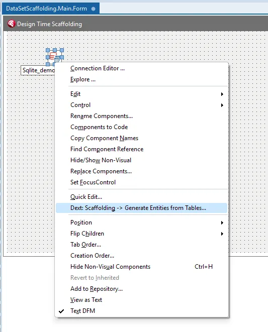
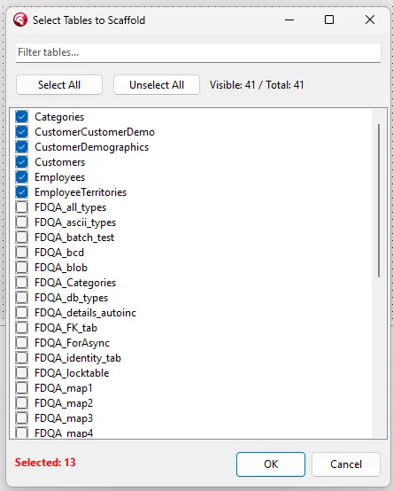
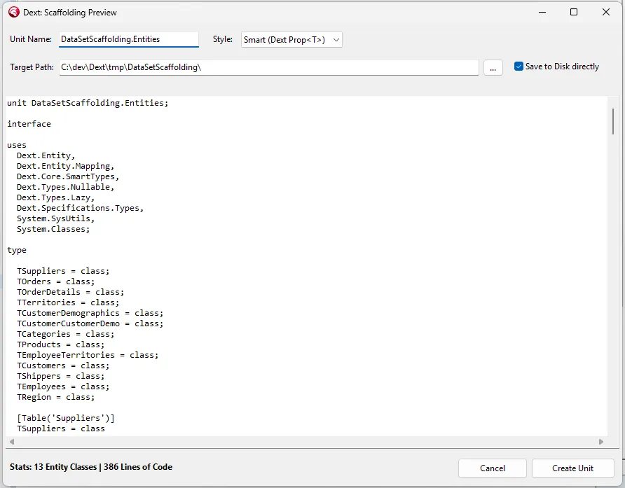
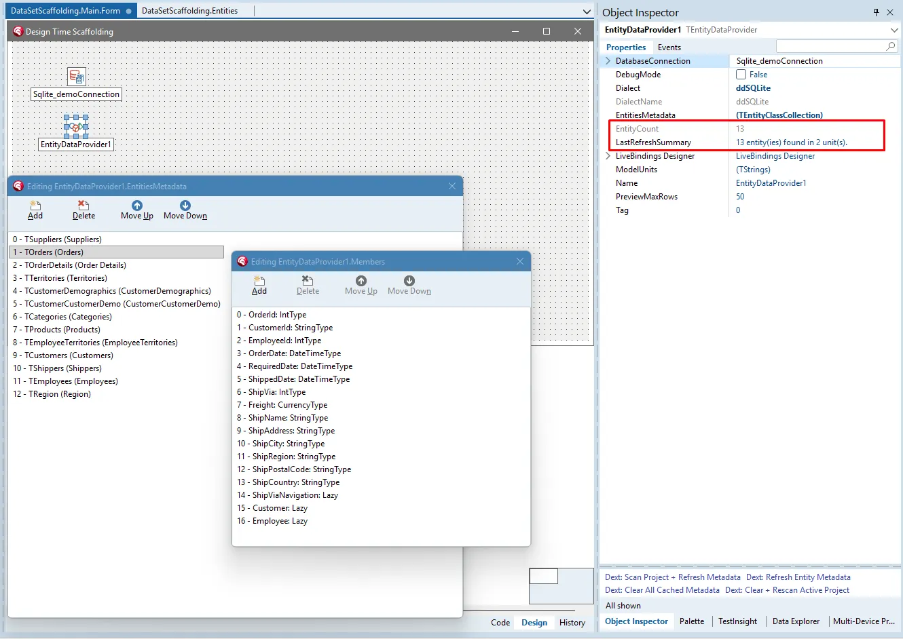
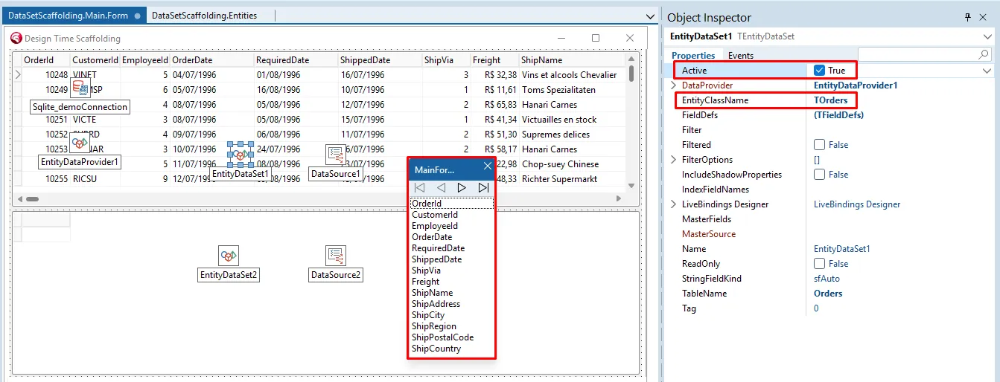

[🇺🇸 English](README.md)

# Dext Framework
**Modern Full-Stack Development for Delphi**

<p align="center">
  
</p>

---

> [!IMPORTANT]
> O Dext Framework está atualmente em **Versão 1 Release Candidate (RC2)**.

O **Dext Framework** é um ecossistema nativo e integrado para o desenvolvimento em Delphi.

Ele une Injeção de Dependência, ORM, Web Pipeline e Testes em uma arquitetura única de altíssima performance. Desenvolvido para eliminar a necessidade de conectar bibliotecas isoladas e reduzir drasticamente o código *boilerplate*, o Dext resolve a complexidade da infraestrutura base para que a sua equipe escreva estritamente a regra de negócio.

## Modernização do Delphi & Paridade com o .NET

O Dext foi construído para fechar o abismo de percepção e arquitetura entre o Delphi e plataformas modernas como o .NET Core. Se a sua equipe está considerando migrar um sistema legado VCL/FMX para outra stack moderna devido à falta de padrões corporativos modernos, o Dext oferece uma alternativa nativa completa sem o custo, risco e tempo de reescrever todo o seu código do zero.

Oferecemos paridade funcional completa com os padrões do ASP.NET Core e Entity Framework Core, aproveitando as vantagens da compilação nativa (sem JIT, sem cold starts e com baixíssimo consumo de memória).

Explore nossos guias detalhados de comparação e capacidades:
*   [**Dext vs .NET: Uma Comparação de Arquitetura**](Docs/Comparison/Dext_vs_DotNet_Narrative.pt-br.md) — Como o Dext une padrões modernos com compilação nativa.
*   [**Matriz de Paridade Recurso por Recurso**](Docs/Comparison/Feature_Comparison_Dext_vs_DotNet.pt-br.md) — Mais de 60 recursos comparados diretamente entre o ASP.NET/EF Core e o Dext.
*   [**Referência Completa de Recursos do ORM**](Docs/Comparison/Dext_ORM_Capabilities.pt-br.md) — DbContext, Change Tracking, colunas JSON e estratégias Lazy/Eager.
*   [**Guia de Licenciamento Corporativo**](Docs/Comparison/Open_Source_Licensing_Enterprise.pt-br.md) — Por que o Dext é 100% gratuito e seguro para uso comercial sob a Licença Apache 2.0.

## Onde Usar?

O Dext foi desenhado especificamente para resolver as dores reais enfrentadas pelos desenvolvedores Delphi:

* **Web Applications:** Desenvolva aplicações web completas com renderização Server-Side, utilizando WebStencils ou templates nativos integrados ao pipeline.
* **APIs de Alta Performance:** Construa backends RESTful robustos usando *Minimal APIs*, *Controllers* ou gerando endpoints diretos com o atributo `[DataApi]`.
* **Concorrência e Assincronismo:** Utilize o *Dext Threading* (Async Task, Cancellation Token, Async Rest Client) para criar rotinas em *background* e fluxos de trabalho não-bloqueantes, substituindo o uso manual e complexo da classe `TThread`.
* **Backend Mobile (iOS/Android):** Forneça a infraestrutura de integração, conectividade e segurança necessária para suportar aplicativos mobile de forma eficiente.
* **Modernização de Legados:** Integre-se gradualmente a sistemas de 3 camadas antigos (como DataSnap), middlewares ISAPI/Apache ou monolitos Desktop (VCL) sem precisar reescrever seu ERP de 20 anos. O Dext atua como uma fundação moderna dentro de sistemas existentes.
* **Serviços Background e Microserviços:** Extração de dados robusta, tarefas agendadas de alta performance e conectividade entre aplicações.

---

## Quick Start

Veja como a estrutura do Dext simplifica fluxos complexos em código limpo, tipado e orientado a objetos. Explorando os pilares do framework:

### Minimal API

Criar um endpoint de alta performance e integrado com Injeção de Dependências exige o mínimo de esforço:

```pascal
program MyAPI;

uses Dext.Web;

begin
  var App := WebApplication;
  
  // Endpoint simples
  App.MapGet('/hello', function: string
  begin
    Result := 'Hello from Dext! Modern full-stack for Delphi.';
  end);

  // Endpoint com Injeção Automática (DI) e Model Binding nativos
  App.MapPost<TUserDto, IEmailService, IResult>('/register',
    function(Dto: TUserDto; EmailService: IEmailService): IResult
    begin
      EmailService.SendWelcome(Dto.Email);
      Result := Results.Created('/login', 'Usuário registrado com sucesso');
    end);

  App.Run(8080);
end.
```

### Entidade Simples (COC, DataApi e Smart Properties)

Mapeamento automático via *Convention over Configuration* e propriedades estruturadas para mapeamento relacional avançado:

```pascal
[Table]
[DataApi('/api/orders')] // Exposto automaticamente como REST API (Zero-Code API)!
TOrder = class
private
  FId: IntType;
  FStatus: Prop<TOrderStatus>;
  FNotes: StringType;
  FTotal: Nullable<CurrencyType>;
  FItems: Lazy<IList<TOrderItem>>;
public
  [PK, AutoInc]
  property Id: IntType read FId write FId;
  property Status: Prop<TOrderStatus> read FStatus write FStatus;
  property Notes: StringType read FNotes write FNotes;
  
  // Smart Types para lidar nativamente com nulos, validação e Lazy Loading
  property Total: Nullable<CurrencyType> read FTotal write FTotal;
  property Items: Lazy<IList<TOrderItem>> read FItems write FItems;
end;
```

### ORM e Queries Fortemente Tipadas (Type-Safe)

Chega de *magic strings* ou queries quebradas em runtime. O Dext gera a árvore sintática abstrata (AST) do seu código:

```pascal
// Consulta complexa com Joins e Filtros interpretada como código limpo
var O := Prototype.Entity<TOrder>;

var Orders := DbContext.Orders
  .Where((O.Status = TOrderStatus.Paid) and (O.Total > 1000))
  .Include('Customer') // Eager Loading
  .Include('Items')
  .OrderBy(O.Date.Desc)
  .Take(50)
  .ToList;

// Bulk Update direto no SGBD sem carregar registros em memória
DbContext.Products
  .Where(Prototype.Entity<TProduct>.Category = 'Outdated')
  .Update
  .Execute;
```

### Processamento Assíncrono (Fluent Tasks)

A abstração `Fluent Async Tasks` entrega superpoderes sobre a `PPL` (*Parallel Programming Library*) e `Future<T>`, permitindo pipelines encadeados baseados no *Thread Pool*:

```pascal
var CTS := TCancellationTokenSource.Create;

TAsyncTask.Run<TStream>(
  function: TStream
  begin
    // Solicita uma Task livre ao Thread Pool para download via rede
    Result := AsyncClient.DownloadStream('https://api.empresa.com/dados', CTS.Token);
  end)
  .Then<TReport>(
    function(Stream: TStream): TReport
    begin
      // Encadeia uma nova Task de processamento assim que a anterior terminar
      Result := JsonSerializer.Deserialize<TReport>(Stream);
      Stream.Free;
    end)
  .OnComplete(
    procedure(Report: TReport)
    begin
      // Sincroniza o retorno com a Thread Original (UI) de forma automática e segura
      ShowReport(Report);
    end)
  .OnException(
    procedure(Ex: Exception)
    begin
      ShowError('Falha no processo: ' + Ex.Message);
    end)
  .Start;
```

### Configuration, Options & DI

Ambiente estruturado para registro de serviços e configurações externas consumindo `JSON`, `YAML` ou variáveis de ambiente:

```pascal
  var Builder := WebApplication.CreateBuilder;
  
  // Carrega fontes de configuração hierárquicas
  Builder.Configuration
    .AddJsonFile('appsettings.json')
    .AddYamlFile('config.yaml')
    .AddEnvironmentVariables;
  
  Builder.Services
    // Vincula as variáveis lidas nativamente para uma classe estrita
    .Configure<TDatabaseSettings>(Builder.Configuration.GetSection('Database'))
    
    // Injeção de dependência completa de repositórios e serviços
    .AddSingleton<IEmailService, TSmtpEmailService>
    .AddScoped<IOrderRepository, TDbOrderRepository>;
    
  var App := Builder.Build;
```

### Compatibilidade Total com VCL (TEntityDataSet)

O `TEntityDataSet` converte a orientação a objetos do ORM (POCOs) para estruturas *DataSet-compatible* consumíveis pelas suas grids VCL, componentes data-aware e relatórios criados em *Design Time*, sem perder performance!

> Suporte Design-Time: Criação de *TFields* a partir do código das entidades e visualização dos registros diretamente na IDE.

---

## ⚡ Poder de Nível Enterprise: O Dext vai Muito Além do Básico

Muitos frameworks focam apenas em soluções simples de CRUD. O Dext foi projetado para arquiteturas corporativas complexas e de alta escala. Veja recursos avançados que mostram o poder real da nossa infraestrutura:

### 1. Database as API (REST CRUD Zero-Code)
Gere uma API REST CRUD completa diretamente das suas entidades de domínio com suporte a paginação, ordenação, segurança granular e OpenAPI/Swagger com apenas um atributo:

```pascal
[Table, DataApi('/api/products')]
TProduct = class
private
  FId: IntType;
  [Required, MaxLength(100)]
  FName: StringType;
  FPrice: CurrencyType;
public
  [PK, AutoInc]
  property Id: IntType read FId write FId;
  property Name: StringType read FName write FName;
  property Price: CurrencyType read FPrice write FPrice;
end;

// Configuração granular de segurança e inicialização em uma única linha:
App.MapDataApis.Configure<TProduct>(
  DataApiOptions.RequireAuth.RequireWriteRole(['admin'])
);
```

### 2. Servidor MCP Nativo (Seu Delphi Pronto para IAs)
O Dext é o primeiro framework do planeta com suporte nativo e integrado ao **Model Context Protocol (MCP)**. Exponha a lógica e as consultas do seu sistema corporativo diretamente como ferramentas para agentes de IA (como Claude, Cursor ou Antigravity) consumirem de forma segura:

```pascal
type
  [MCPTool('search_products', 'Busca produtos ativos com filtros de preço')]
  [MCPParam('query', 'Termo de pesquisa do produto')]
  [MCPParam('maxPrice', 'Filtro opcional de preço máximo')]
  TSearchProductsTool = class
  public
    function Execute(const AQuery: string; AMaxPrice: Currency): TList<TProduct>;
  end;
```

### 3. Clean Architecture & Design-Time VCL
Desenvolva projetos seguindo os padrões de Clean Architecture, garantindo alto desacoplamento e testabilidade sem perder a produtividade visual do RAD tradicional:

*   **Design-Time Preview:** Conecte o dataset visualmente na IDE, crie campos estáticos (TFields) dinamicamente e pré-visualize dados reais do banco *sem precisar compilar o projeto*.
*   **Desacoplamento Real:** Remova conexões diretas do banco e queries espalhadas pelas suas telas, mantendo sua UI focada na apresentação enquanto consome entidades puras sob uma arquitetura limpa.

<details>
<summary><b>📸 Veja o Fluxo Completo de Design-Time em Ação (Scaffolding ➡️ Conexão ➡️ Live Data)</b></summary>
<br>

Para demonstrar que a modernização não quebra a produtividade visual clássica do Delphi RAD, o Dext se integra nativamente ao ecossistema da IDE. Veja o passo a passo interativo de como sair do banco físico para dados vivos no formulário em segundos:

#### 1. Geração de Entidades via Context Menu
Diga adeus ao mapeamento manual. Clique com o botão direito no formulário e acesse a ferramenta de geração integrada:
<p align="center">
  
</p>

#### 2. Seleção Inteligente de Tabelas
Selecione quais tabelas do seu banco de dados físico você deseja trazer para o seu modelo de domínio:
<p align="center">
  
</p>

#### 3. Visualização do Código Gerado
O Dext gera unidades Object Pascal limpas, elegantes, fortemente tipadas e decoradas com atributos inteligentes:
<p align="center">
  
</p>

#### 4. Inspeção Visual das Propriedades RTTI
Conecte o `TEntityDataProvider` ao seu banco. O Dext varre o seu executável via RTTI e mapeia dinamicamente as classes de entidades diretamente no Object Inspector da IDE:
<p align="center">
  
</p>

#### 5. Dados Vivos em Tempo de Design
Conecte o `TEntityDataSet` ao provider, defina a classe alvo e marque `Active = True`. Seu DBGrid se popula instantaneamente com dados reais do banco *sem precisar rodar o aplicativo*:
<p align="center">
  
</p>

</details>

### 4. CQRS Stored Procedures
Esqueça a vinculação manual de parâmetros e queries SQL manuais para execução de procedures. O Dext gerencia procedures complexas como comandos fortemente tipados e verificados em tempo de compilação:

```pascal
type
  [StoredProcedure('ProcessFiscalNotes')]
  TProcessNotesCommand = class
  private
    FStartDate: TDateTime;
    FProcessedCount: Integer;
  public
    [DbParam('StartDate')]
    property StartDate: TDateTime read FStartDate write FStartDate;
    
    [DbParam('ProcessedCount', pdOutput)]
    property ProcessedCount: Integer read FProcessedCount write FProcessedCount;
  end;
```

---

## 📊 Telemetria Visual e Diagnósticos Integrados

Esqueça a necessidade de configurar infraestruturas complexas de APM (como Prometheus e Grafana) para ambientes locais de desenvolvimento. O Dext inclui um **Dashboard Visual de Telemetria** integrado de forma nativa e assíncrona.

Ele coleta (com zero impacto de thread e sem alocação bloqueante) logs estruturados, profiling completo de consultas SQL físicas, tempos de resposta HTTP e spans detalhados de Gantt para depuração rápida de gargalos de rede e banco de dados:

<p align="center">
  
</p>

<details>
<summary><b>📸 Ver Visão Geral do Painel e Rastreamento Detalhado de SQL (Traces)</b></summary>
<br>

#### Visão Geral do Painel (Painel de Métricas e Logs em Tempo Real)
Monitore throughput (RPS), latência média, consumo de CPU/Memória, conexões ativas de banco de dados e logs do sistema em uma única tela unificada:
<p align="center">
  
</p>

#### Rastreamento Detalhado de Consultas SQL (Tracing & Spans)
Analise o fluxo interno de execução do ORM em formato Gantt, visualizando exatamente a query SQL gerada, parâmetros injetados e tempo de resposta de cada transação física:
<p align="center">
  
</p>

</details>

---

## Features Principais

<p align="center">
  
</p>

O Dext é composto por módulos flexíveis e minimalistas. Você retém total controle sobre a arquitetura e inclui apenas os componentes vitais para sua solução:

* **Core Technologies:** Injeção de dependência de classe Enterprise (Singleton, Transient, Scoped), cache de Reflexão otimizado, suporte avançado a eventos e IOptions.
* **Coleções Nativas Limpas:** Extinção de *memory leaks* utilizando interfaces (`IList`, `IDictionary`). O Dext resolve o clássico *Generic Bloat* com Binary Code Folding, reduzindo significativamente binários enormes.
* **Data Access (ORM):** Gerenciamento robusto via *Unit of Work*, controle automático de transações (DAO support), e suporte multi-banco.
* **Web Frameworks:** Servidor HTTP incrustado, *Minimal APIs*, *Controllers*, gerador REST *DataAPI*, middlewares modulares, *WebSockets* (Hubs), CORS nativo, *Suporte HTMX nativo*, **HTTP/2 Framing** (HPACK + Streams Multiplexados) e renderização extremamente ágil.
* **Inteligência Artificial e Agentes:** Servidor **MCP (Model Context Protocol)** nativo para integração perfeita com assistentes de IA (como o Claude), expondo sua regra de negócio Delphi como ferramentas de IA via sessões HTTP Streamable.
* **Testing & Qualidade:** Framework TestContext acoplado, *Mock Objects* automatizados (`TAutoMocker`), cobertura de testes e relatórios.

**[Ver a lista de features completas e módulos do Dext](Docs/Features_Implemented_Index.pt-br.md)**

---

## Instalação

A maneira mais fácil de instalar o Dext é usando o **TMS Smart Setup**. Alternativamente, você pode fazer a instalação manual diretamente na IDE.

### 1. Instalação Automatizada (TMS Smart Setup - Recomendado)
Você pode instalar o Dext tanto pela interface gráfica (GUI) quanto pela linha de comando:
* **GUI**: Abra o cliente do **TMS Smart Setup**, pesquise por `cesarliws.dext` (Dext Framework), selecione-o e clique em **Install**.
* **CLI**: Execute o seguinte comando no seu terminal:
  ```bash
  tms install cesarliws.dext
  ```

> [!TIP]
> Não tem o TMS Smart Setup instalado? Baixe-o na [Página de Download do TMS Smart Setup](https://doc.tmssoftware.com/smartsetup/download/).

### 2. Instalação Manual
Para compilação manual, configuração de variáveis de ambiente/paths, personalização através do `Dext.inc` e instalação de pacotes de design-time diretamente na IDE do Delphi:

*   **[Ler as Instruções Detalhadas de Setup e Instalação](Docs/Book.pt-br/01-primeiros-passos/instalacao.md)**


### Requisitos e Compatibilidade
* **Delphi:** 10.3 Rio ou superior (Suporte completo a 10.4, 11 e 12 Athens).
* **Versões Legadas:** Pode ser compilado no 10.1 Berlin com limitações.
* **Dependências:** Nenhuma dependência externa obrigatória (usa componentes nativos).
  * **Camada HTTP:** Utiliza componentes Indy (já incluídos no Delphi) para a camada de transporte HTTP — sujeito a substituição futura / otimizações adicionais.

**[Matriz de Compatibilidade Detalhada](Docs/Delphi_Compatibility_Matrix.md)**

---

## Design e Filosofia: Nascido para Performance

O Delphi historicamente foi escolhido para domínios que não toleravam overheads, entretanto frameworks recentes adotaram padrões de alocação desenfreada baseados na facilidade do desenvolvedor. **O Dext devolve a performance, mas mantém a facilidade moderna:**

<p align="center">
  
</p>

1. **Zero-Allocation Pipeline:** Quando o servidor expõe um JSON ou dados, componentes comuns instanciam e processam gigabytes de `string` provisórias causando picos mortais no Memory Manager e pausas forçadas. O Dext contorna a conversão clássica através de *Direct-to-JSON streaming*, lendo blocos inteiros via estruturas de memória imutável (`TSpan`). 
2. **Hardware Affinity (SIMD):** As camadas subjacentes se beneficiam de computação paralela usando SIMD (Single Instruction, Multiple Data) no parseamento para garantir resposta em pouquíssimos *ticks* de CPU.

---

## Open Source e Licença

**Dext** é desenvolvido e mantido publicamente e fornecido sob a **Licença Apache 2.0**.
É integralmente e incondicionalmente gratuito (para cenários *open-source* ou desenvolvimento estrito *enterprise*/comercial). Crie softwares bilionários, distribua ou encapsule à vontade. Sem pegadinhas.

---

## Faça Parte da Comunidade

O Dext é movido pela comunidade. Seja você um usuário entusiasta ou um desenvolvedor focado em infraestrutura, há várias formas de ajudar:

* **Espalhe a palavra:** Se o Dext é útil para você, considere **deixar uma estrela (Star)** no repositório. Isso ajuda o projeto a ganhar visibilidade e atrair mais contribuidores.
* **Compartilhe seu Sucesso:** Criou algo incrível com Dext? Adoraríamos conhecer seu caso de uso. Envie um relato nas [Discussions](https://github.com/cesarliws/dext/discussions).
* **Para Usuários:** Comece a usar o framework em seus projetos e nos dê feedback real sobre a experiência de uso.
* **Para Contribuidores:** Registre instabilidades (*issues*), sugira melhorias ou envie um *pull-request*.
  * Siga as [Instruções de Contribuição](CONTRIBUTING.md)
  * Quer enviar novas Features? Siga o documento do [Workflow de Features e Melhorias](Docs/CONTRIBUTING_IMPROVEMENTS.md)

Conheça as métricas e passos do nosso [Roadmap](Docs/ROADMAP.md) e veja nosso documento de **[Código de Conduta](./CODE_OF_CONDUCT.md)** para manter este *hub* receptivo.

<br>
<p align="center">
  <i>Pare de reconstruir fundações e gaste energia nos problemas dos seus clientes. Dext cuida do resto.</i><br>
  <b>Feito com orgulho para todo o Ecossistema Delphi.</b>
</p>
